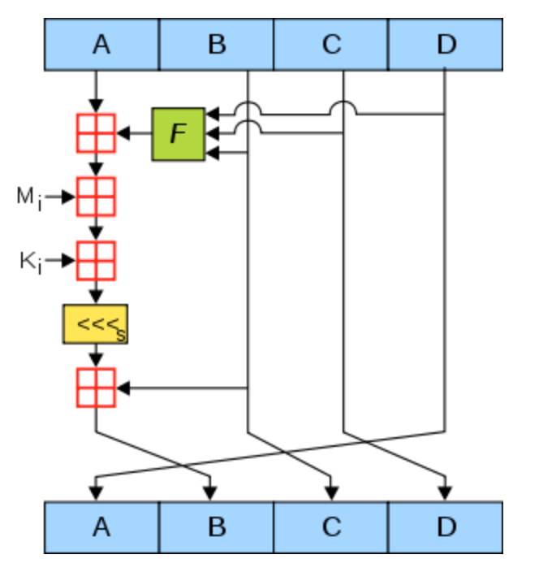
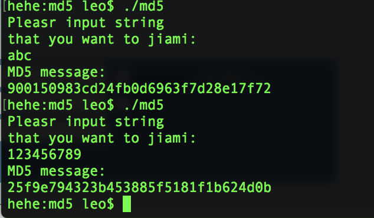

## 信息安全第二次作业

### 实现MD5加密算法

#### 一、算法原理概述

整个算法分成四步：

1. 处理原文

   计算出原文长度（单位bit）对512的求余结果，如果不等448，那么需要补充位数是的余数位448。这个填充的位数必须要大于1，也就意味着，**如果余数正好是448，需要补充512位**。补充的位的内容就是第一位为1，其余后面的都是0。然后在讲后面的64位填上原文的长度。最终得到的结果的位数是512的整数倍。

2. 切割原文

   为了方便后续的加密操作，每次一加密的长度都必须是512位，也就需要我们将原文切割成512位一组的数据。每一组需要进行一次总的**步骤三**

3. 循环迭代处理

   这一步是整个算法的关键所在。共进行64次迭代。每一次迭代ABCD的值都会发生相应的改变。对于64次迭代的单次迭代流程如下：

   

   - 绿框的F

     表示循环迭代调用的函数。

     0~15：调用F，并且得到一个k = i，k表示在原文中的第几个

     16~31：调用G，得到k =(5*i+1)%16

     32~47：调用H，k=(3*i+5)%16

     48~63：调用I，k=(7*i)%16

   - 接下来的红色框表示相加，规则如下
   
     假设f位上步调用的函数，M表示需要进行加密的信息，T表示以表格，通过正弦函数可得到，S表示一个移动的位数的表，T、S都是常量
   
     f + a
   
     f+a+M[k]
   
     f+a+M[k]+T[i] (*T[i]可以写成2^32 x abs(sin(i/PI))*)
   
     并且开始循环移位
   
     CLS(f+a+M[k]+T[i], S[i])
   
     移位结束后再加上b的值得到了一个新的b，并且ACD的值也都需要做相应的改动，规则如下
   
     b = b + CLS(f+a+M[k]+T[i], S[i])
   
     a = d
   
     d = c
   
     c = b
   
4. 获取密文

   经过步骤三后，在abcd的基础上还需要分别加上ABCD。然后将这个四个值加起来。就得到了最终的结果

#### 二、总体结构

按照算法的原理，我将整个算法分成了5个函数来实现

- padding

  对原文进行处理扩展

- CLS

  在迭代循环中将得到的值进行移位

- Hmd5

  包含64次迭代

- hexToStr

  16进制数字转化为字符串，用来表示最终的结果

- MD5

  将原文分成若干组，然后分别调用Hmd5求的密文

#### 三、数据结构

由于给出来的T值是32位的16进制数字，并且ABCD都是这样类型的值，所以在整个程序中我都是采用了unsigned int作为主要的数据结构。这样的话比较方便后续的操作

#### 四、模块分解及程序说明

- padding

  `unsigned int * padding(string originalText)`

  采用`unsigned int`作为填充结果，**1 unsigned int = 4 char = 32 bit**，需要先找出来原文填充之后的分组数。如果这个数字mod 512 小于 448那么也就意味着填充完之后不会超过512，如果 mod 512 大于 448，那么填充完之后肯定跳到了下一个512了。所以x + 64 / 512 + 1就是填充之后512的组数。

  ```c++
  group_num = (originalText.length()+8) / 64 + 1;
  
  	unsigned int * res = new unsigned int[group_num * 16];
  	int i = 0;
  	for(i = 0; i < group_num * 16; ++ i) {
  		res[i] = 0;	//初始化，并且扩充时不用理会添加的0	
  	}
  ```

  并且将内容都出初始化为0，那么之后的填充部分的0就无需处理。接下来需要将原文的内容存放到res里面。需要注意的是4个char才能填满1个unsigned int。

  ```c++
  int cnt = 0;
  	for(i = 0; i < originalText.length(); ++ i) {
  		res[cnt] |=  (originalText[i] << ((i%4)*8));
  		if((i+1) % 4 == 0) cnt ++;
  	}
  
  ```

  接下来还需要在后面填充一个1，同时将原文的长度存放到res中。

  ```c++
  	res[cnt] |= 0x80 << ((i%4)*8);
  	//后面64位加上长度
  	//string.length本来就是unsigned long 32位
  	//所以只会用到32位
  	res[group_num*16 - 2] = originalText.length() * 8;
  	return res;
  
  ```

- CLS

  将内容循环左移相应的位数

  ```c++
  	unsigned int res = content << offset;
  	//还需要处理将左边的移到右边
  	res |= content >> (32 - offset);
  	return res;
  ```

- Hmd5

  这个是64次循环函数，其实实现起来还是不难的。分成64次循环，没次循环调用不同的函数，并且同时改变abcd。最终的结果就是abcd再分别加上ABCD。这里最容易错的是没次循环结束后的abcd左移循环。

  ```c++
  for(int i = 0; i < 64; ++ i) {
  		if(i < 16) {	//F
  			f = F(b,c,d);
  			k = i;
  		}
  		else if(i < 32) {
  			f = G(b,c,d);
  			k = (5*i + 1) % 16;
  			//按照算法的要求实际上应该写成
  			//k = (5*(i - 16) + 1) % 16
  		}
  		else if(i < 48) {
  			f = H(b,c,d);
  			k = (3 * i + 5) % 16;
  		}
  		else if(i < 64) {
  			f = I(b,c,d);
  			k = (7 * i) % 16;
  		}
  
  		//第一步对A进行迭代，得到的值假设为t
  		//那么下一个位置A的值就会变成t。
  		//如果顺序为
  		//ABCD
  		//abcd
  		//那么接下来就变成了
  		//ABCD
  		//tcda
  		unsigned int t = b + CLS(a + f + mes[k] + T[i], S[i]);
  		//这个T【i】可以写成
  		//unsigned int T = 2^32 * abs(sin(i/PI))
  		unsigned int temp = d;
  		d = c;
  		c = b;
  		b = t;
  		a = temp;
  	}
  	//分别加起来
  	aTemp += a;
  	bTemp += b;
  	cTemp += c;
  	dTemp += d;
  ```

- hexToStr

  讲一个32位16进制数转化为字符串的形式。之所以这么做是结果需要将ABCD都加起来，不是数字的相加，是字符串的相加。**这里需要特别注意，需要将两个16进制数分为一组，得到后再将这两个进行逆序排列，这是因为ABCD的存储方式为小端序**。

  ```c++
  		string plate = "0123456789abcdef";
      string res = "";
      string temp = "";
      for(int i = 0; i < 8; ++i) {
          unsigned int index = hexNum>>(i*4) & 0xf;
  //        res += plate[index];
          temp += plate[index];
          if((i+1) % 2 == 0) {
              reverse(temp.begin(), temp.end());
              res += temp;
              temp = "";
          }
      }
  ```

- MD5

  这个是主要的调用函数。先将扩展后的原文分成512位一组，组数其实已经在`padding`函数时传递到了全局变量中。

  ```c++
  unsigned int * paddingMes = padding(message);
  	//分组
  	cout<<paddingMes<<endl;
  	for(int i = 0; i < group_num; ++ i) {
  		unsigned int mes[16];
  		for(int j = 0; j < 16; ++ j){
  			mes[j] = paddingMes[i * 16 + j];
  		}
  		Hmd5(mes);
  	}
  	return hexToStr(aTemp)+hexToStr(bTemp)+hexToStr(cTemp)+hexToStr(dTemp);
  ```

#### 五、运行结果



和网上的在线加密结果对比后是正确的。

