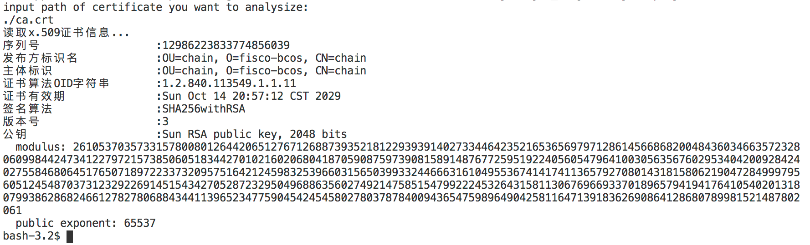

## 信息安全第三次作业

### 17343065 李秀祥

### 分析x.509证书结构

> 此次作业的目的不在于实现对x.509证书的解析

#### 一、x.509证书结构描述

>  **X.509**是密码学里公钥证书的格式标准。**X.509**证书己应用在包括TLS/SSL在内的众多Intenet协议里。同时它也用在很多非在线应用场景里，比如电子签名服务。**X.509**证书里含有公钥、身份信息和签名信息。对于一份经由可信的证书签发机构签名或者可以通过其它方式验证的证书，证书的拥有者就可以用证书及相应的私钥来创建安全的通信，对文档进行数字签名。

x.509证书结构如下：

> OU: 机构单元名称
>
> O:	结构名
>
> CN:	通用名称

| 序列号       | 用于识别证书，对于同一个CA发布的证书每个证书的序列号唯一     |
| ------------ | ------------------------------------------------------------ |
| 发布方标识名 | 发布方的标识，包含OU、O、CN三个信息                          |
| 主体标识     | 使用x.500标准，证书可以识别其公钥的实体名，包含OU、O、CN三个信息 |
| 证书算法OID  | 证书算法的OID（Object Identifier）                           |
| 证书有效期   | 证书的有效期                                                 |
| 签名算法     | 证书的签名算法                                               |
| 版本号       | 目前为止，已经使用了三个版本                                 |
| 公钥         | 证书的公钥，同时包括指定该密钥所属公钥密码系统算法标识符及所有相关的密钥参数 |

#### 二、数据结构

我是直接使用的JAVA封装好的库，查看证书的各种信息，直接调用的函数。具体的步骤：先读取证书，然后找一个`certificatefactory`存起来，接着将其转化为`x509certificate`，然后就可以里调用其包含的函数了。

```java
		X509Certificate cer = null;
		CertificateFactory factory = CertificateFactory.getInstance("X.509");
		FileInputStream file = new FileInputStream(path);
		cer = (X509Certificate)factory.generateCertificate(file);
		file.close();
		
		System.out.println("读取x.509证书信息...");
		System.out.println("序列号			:"+cer.getSerialNumber());
		System.out.println("发布方标识名	 	:"+cer.getIssuerDN()); 
		System.out.println("主体标识	    	:"+cer.getSubjectDN());
		System.out.println("证书算法OID字符串	:"+cer.getSigAlgOID());
		System.out.println("证书有效期		:"+cer.getNotAfter());
		System.out.println("签名算法		:"+cer.getSigAlgName());
		System.out.println("版本号			:"+cer.getVersion());
		System.out.println("公钥			:"+cer.getPublicKey());
```


#### 三、结果截图

我使用的是区块链课上，生成节点时会生成相应的密钥。

